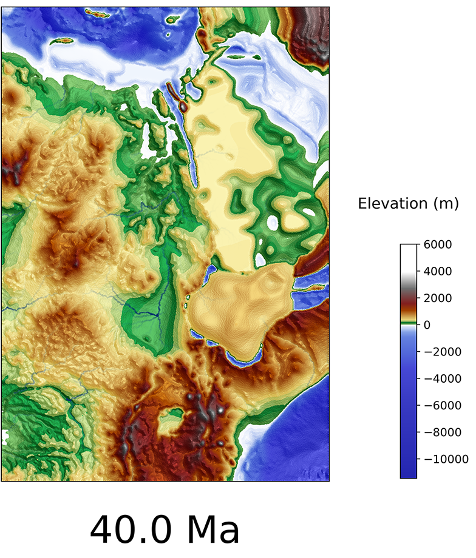

## Inputs

This directory contains the `.xml` input files for three of the Badlands models used in the study.
The input data for these models is hosted on Zenodo, and can be downloaded from this link: [https://zenodo.org/record/4321853/files/data-bundle.zip](https://zenodo.org/record/4321853/files/data-bundle.zip).
Alternatively, run the file named `setup.sh` in the main directory to download all input data.

  

